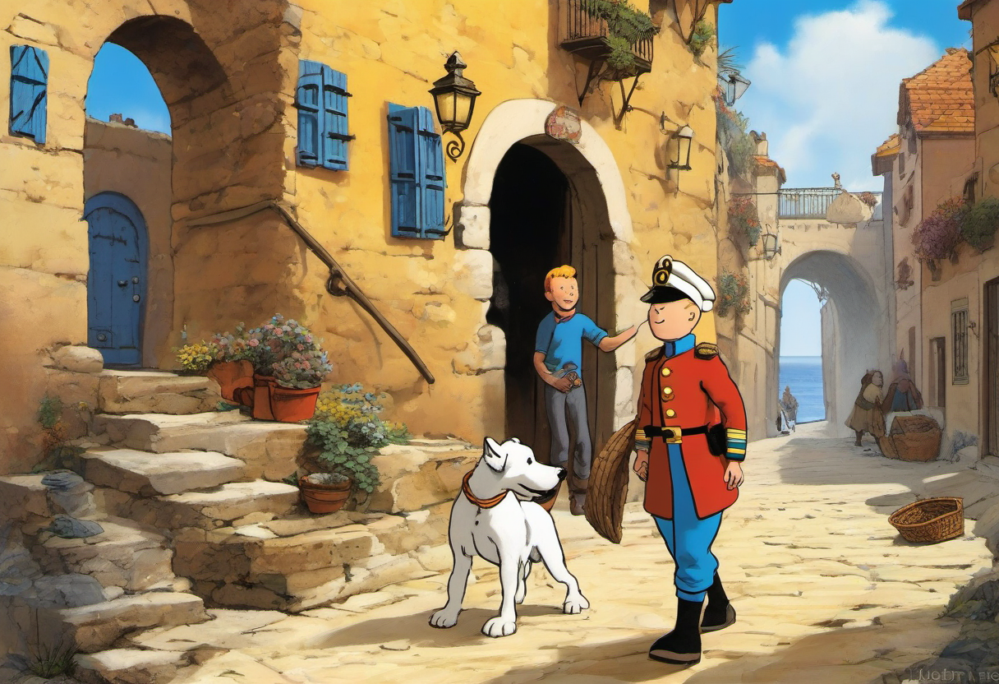

# Story Illustration Generator with ComfyUI & SDXL

A node-based workflow for generating illustrations from text using [ComfyUI](https://github.com/comfyanonymous/ComfyUI), [Stable Diffusion XL (SDXL)](https://huggingface.co/stabilityai/stable-diffusion-xl-base-1.0), and SDXL-compatible LoRA models.  

## SDXL Model

SDXL base model (`sd_xl_base_1.0.safetensors`).
From [Hugging Face](https://huggingface.co/stabilityai/stable-diffusion-xl-base-1.0) 

## Features

- **Text-to-image generation** using SDXL 1.0
- **LoRA integration** for storybook/children’s illustration styles
- **Prompt engineering** for detailed, creative scenes

## Example Output

### prompt (with added weight)
(storybook-style digital painting:1.3), (soft painterly textures:1.2), (warm sunlight:1.1), (cool shadows:1.1), (highly detailed:1.3), (dynamic composition:1.2), (magical and nostalgic tone:1.2), (young boy:1.3), (determination:1.1), (Snowy:1.4), (small white dog:1.3), (Captain Haddock:1.4), (bearded man:1.2), (blue sailor's outfit:1.2), (crumbling stone bridge:1.2), (narrow sunlit alley:1.1), (Moroccan port town:1.3), (hawk flying:1.2), (clutching a scroll:1.1), (bustling market stalls:1.2), (vibrant buildings:1.2), (colorful awnings:1.1), (boats in harbor:1.1), (sense of urgency:1.2), (adventure:1.3)

## LoRA:
a SDXL compatible LoRA ([MeMaXL Flat Anime Style](https://civitai.com/models/269772?modelVersionId=502956)) From [Civitai](https://civitai.com/)  
a SDXL compatible LoRA ([StoryBook.Redmond V2](https://huggingface.co/artificialguybr/StoryBookRedmond-V2)) From [Hugging Face](https://huggingface.co/)

## Credits

- [ComfyUI](https://github.com/comfyanonymous/ComfyUI)
- [Stability AI - SDXL](https://huggingface.co/stabilityai/stable-diffusion-xl-base-1.0)
- [artificialguybr/StoryBookRedmond-V2](https://huggingface.co/artificialguybr/StoryBookRedmond-V2)
- [MeMaXL Flat Anime Style](https://civitai.com/models/269772?modelVersionId=502956)